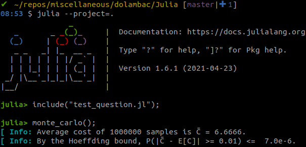

# Monte-Carlo Simulation

The Julia file tests the theoretical result. Here are the steps to follow:

1. Run Julia: `julia --project=.`
2. Include the file: `include("test_question.jl")`
3. Run Monte-Carlo simulation: `monte_carlo(iter=1_000_000)`

<!-- ## Sample result: -->

## State Distribution
