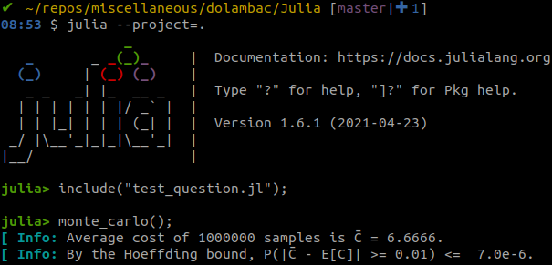
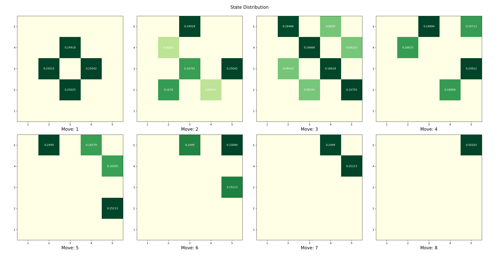
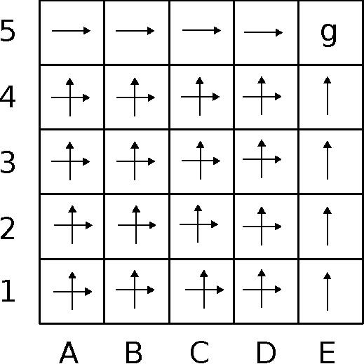

# İlginç bir olasılık sorusu

Bu basit ama çok ilginç soru sevgili arkadaşım Gökhan Atınç tarafından tasarlandı.

* Sorunun açıklaması ve çözümü şu PDF
  [dökümanında](https://github.com/Symplectomorphism/miscellaneous/blob/master/dolambac/TeX/root.pdf)
  bulunabilir (eğer ilk sayfa herhangi bir nedenden dolayı boş görünüyorsa, sağ
  üst köşedeki "Download" tuşuna basın ve sistem göstericisi ile açın).

* Teorik çözüme eşlik eden bir Monte-Carlo simulasyonu Julia
  [klasörünün](https://github.com/Symplectomorphism/miscellaneous/tree/master/dolambac/Julia)
  altında bulunabilir.

# An interesting probability question

This is a simple, yet very interesting question posed by my dear friend Gökhan
Atınç.  

* The question and its solution may be found in the PDF
  [document](https://github.com/Symplectomorphism/miscellaneous/blob/master/dolambac/TeX/english/root.pdf)
  (if the first page is blank for some reason, click "Download" on the top right
  corner and open with system viewer).

* A companion Monte-Carlo simulation to the theoretical solution may be found
  under the Julia
  [folder](https://github.com/Symplectomorphism/miscellaneous/tree/master/dolambac/Julia).

# Numerical Solution

* We can use Monte-Carlo simulation to compute various statistics.
* In particular, we can compute the statistic that the questions asks: what is the expected minimum number of moves it takes to reach the destination?



* We can also use Monte-Carlo simulation to find the probability distribution of the states over all the moves.
* This distribution then obviates the computation of the expected value of minimum moves it takes to reach the destination: ```1/6*4 + 1/3*6 + 1/2*8 = 20/3 = 6.66666...```




* To get this state distribution, we used the following optimal policy, taking the correct action whenever we know the corresponding keymap.

